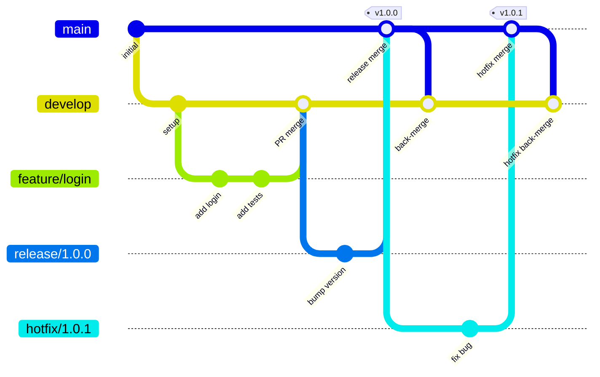

# Gitflow GitHub Actions

A complete set of GitHub Actions workflows that implement the [Gitflow branching model](https://nvie.com/posts/a-successful-git-branching-model/). Drop these into any repository to enforce Gitflow conventions automatically.

## What's Included

| Workflow | Purpose |
|----------|---------|
| `branch-naming.yml` | Validates branch names match Gitflow patterns |
| `pr-validation.yml` | Enforces PR source/target routing rules |
| `feature.yml` | CI placeholder for feature branch PRs |
| `release.yml` | Release validation, tagging, and back-merge to develop |
| `hotfix.yml` | Hotfix validation, tagging, and back-merge to develop + active releases |
| `tag-release.yml` | Creates GitHub Releases on version tag push |
| `cleanup.yml` | Auto-deletes merged branches |
| `init.yml` | One-time setup to create the `develop` branch |

## Quick Start

### Option 1: Copy Files

```bash
# Copy workflows into your project
cp -r .github/workflows/ /path/to/your-project/.github/workflows/

# Initialize Gitflow
cd /path/to/your-project
bash scripts/init-gitflow.sh
```

### Option 2: Reusable Workflows

Reference workflows from this repository in your own repo:

```yaml
# .github/workflows/pr-validation.yml
name: PR Validation
on:
  pull_request:
    types: [opened, edited, reopened, synchronize]
    branches: [main, develop, 'release/**']
jobs:
  validate:
    uses: YOUR_ORG/gitflow-actions/.github/workflows/pr-validation.yml@v1
```

### Option 3: Organization Template

Mark this repository as a GitHub template and use it when creating new repos.

See [docs/IMPORTING.md](docs/IMPORTING.md) for detailed instructions on all methods.

## Branch Flow



## PR Routing Rules

The `pr-validation.yml` workflow enforces these rules:

| Source Branch | Allowed Targets |
|---------------|----------------|
| `feature/*` | `develop` |
| `release/*` | `main`, `develop` |
| `hotfix/*` | `main`, `develop` |
| `merge/*` | `develop`, `release/*` |

Any PR that violates these rules will fail the validation check.

## Branch Protection Setup

Ready-to-import ruleset configurations are included in the `rulesets/` directory. Apply them with a single command:

```bash
./scripts/apply-rulesets.sh
```

This creates rulesets for `main`, `develop`, and optionally `release/*` branches with the correct status checks pre-configured. Use `--dry-run` to preview before applying.

You can also import the JSON files manually via **Settings > Rules > Rulesets > Import a ruleset**.

See [docs/BRANCH-RULES.md](docs/BRANCH-RULES.md) for full details and manual setup instructions.

## Customization

### Adding CI Steps

Edit the `checks` job in `feature.yml` to add your build, test, and lint steps:

```yaml
# In .github/workflows/feature.yml
checks:
  name: Run Checks
  runs-on: ubuntu-latest
  needs: validate
  steps:
    - uses: actions/checkout@v4

    - name: Install dependencies
      run: npm ci

    - name: Lint
      run: npm run lint

    - name: Test
      run: npm test
```

### Using a Custom Token

Tags pushed with the default `GITHUB_TOKEN` do **not** trigger subsequent workflows (this is a GitHub limitation to prevent infinite loops). This means `tag-release.yml` won't run automatically unless you use a custom token.

To enable automatic GitHub Releases and allow tag/branch pushes through rulesets:

1. Create a repository secret (e.g., `GIT_TOKEN`) with a Personal Access Token or GitHub App token
2. In `release.yml` and `hotfix.yml`, replace `secrets.GITHUB_TOKEN` with `secrets.GIT_TOKEN`

## How It Works

### Release Flow
1. Create a `release/x.y.z` branch from `develop`
2. Open a PR to `main` — the workflow validates the version
3. On merge, the workflow:
   - Creates an annotated tag `vx.y.z` on `main`
   - Opens a back-merge PR from a temporary `merge/*` branch to `develop`
4. The tag push triggers `tag-release.yml`, which creates a GitHub Release

### Hotfix Flow
1. Create a `hotfix/x.y.z` branch from `main`
2. Open a PR to `main` — the workflow validates the version
3. On merge, the workflow:
   - Creates an annotated tag `vx.y.z` on `main`
   - Opens back-merge PRs to `develop` and any active `release/*` branches

## Troubleshooting

### "Invalid branch name" error
Branch names must match: `main`, `develop`, `feature/*`, `release/*`, `hotfix/*`, or `merge/*`. Rename your branch to follow the convention.

### "Invalid PR target" error
Check the [PR routing rules](#pr-routing-rules) table. Feature branches can only target `develop`. Release and hotfix branches can target `main` or `develop`.

### Back-merge PR has conflicts
This is expected when `develop` has diverged from `main`. Resolve the conflicts manually in the back-merge PR and merge it.

### Tag already exists
The release/hotfix version in the branch name matches an existing tag. Use a new version number.

### Workflows don't trigger
- Ensure the workflow files are on the default branch (`main`)
- Check that branch protection status checks reference the correct job names
- Verify `GITHUB_TOKEN` permissions in repository settings

## License

[MIT](LICENSE)
